# UNIPAY — User Flows by Role

> Canonical end-to-end workflows for each of the 4 dashboard roles.
> For the route map and per-route role visibility matrix, see [INFORMATION_ARCHITECTURE.md](./INFORMATION_ARCHITECTURE.md).

This document is a **workflow map**, not a user manual. Each flow lists the sequence of screens a role traverses to complete one job-to-be-done, with the routes touched and the permission row that authorizes it.

---

## How to read a flow

Each flow has a **mermaid `flowchart TD` diagram** for visual scan, followed by the prose breakdown. The diagram and the steps are kept in sync — if they drift, the steps win (they cite the route and permission row).

```markdown
### Flow X — Short name

**Role:** owner / finance_manager / operator / viewer
**Trigger:** What prompts the user to start
**Outcome:** What's true after the flow ends

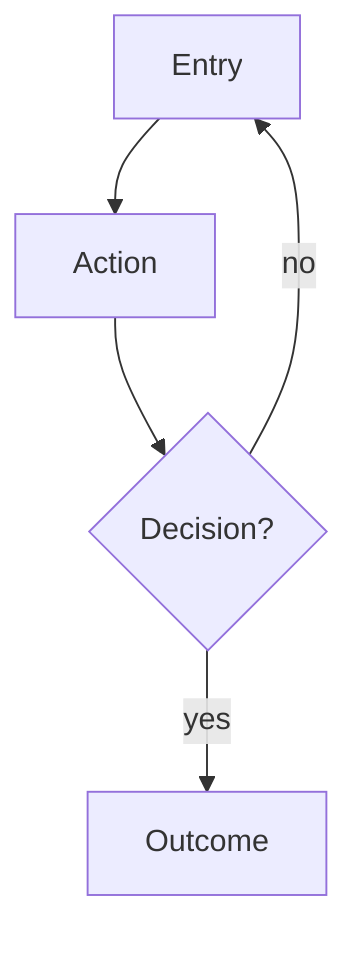

Steps:
1. Sidebar → … (`/route`)
2. Click "…" → next screen
3. …

Routes touched: `/route`, `/route/:id`
Permissions required: `resource.action` per ROLE_PERMISSIONS
Open questions: anything unresolved (PRD-only, not in code)
```

**Diagram conventions** —
- `[Rectangle]` = action / page
- `{Diamond?}` = decision branch
- `-->` = primary edge · `-.label.->` = optional / async / out-of-band edge
- Route paths shown verbatim (e.g. `/staff/:id`); same for `ROLE_PERMISSIONS` resources

When a flow is **spec'd but not yet enforced** by the runtime (e.g. the route exists but no role guard hides it from a Viewer), it's marked **⚠️ Spec only**.

---

## 1. The 4 roles at a glance

| Role | Primary job to be done | Onboarding |
|---|---|---|
| **Owner** | Set up the institution and govern access, billing, audit | First-run wizard |
| **Finance Manager** | Reconcile money in/out: payments, refunds, payouts, reports | Bypasses |
| **Operator** | Front-line work: students, payments, overdues, reminders | Bypasses |
| **Viewer** | Read-only: dashboards, reports, lookup students | Bypasses |

DEV fixtures in [src/lib/auth.ts:69-98](../src/lib/auth.ts) confirm: only `owner@unipay.dev` ships with `onboardingComplete: false`.

---

## 2. Shared flows (apply to every role)

### Flow S1 — Sign in

**Role:** any
**Trigger:** User opens the dashboard URL while signed out
**Outcome:** Authenticated session; landed on `/` (or `/onboarding/:step` for incomplete Owner)

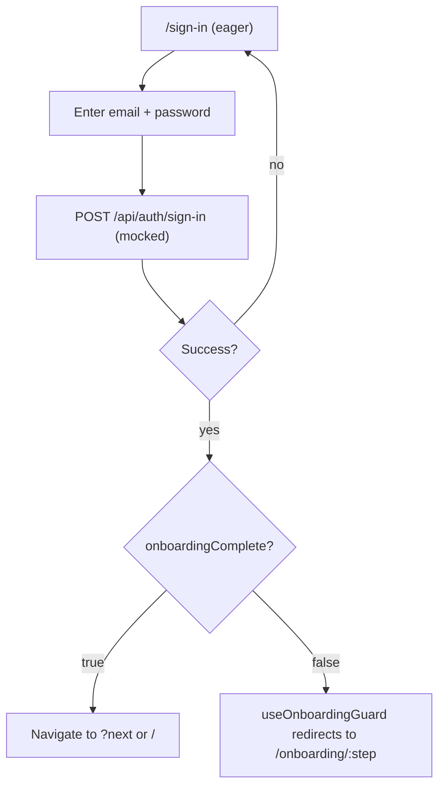

Steps:
1. Land on `/sign-in` (eager-loaded; no skeleton flash).
2. Enter email + password (DEV: role inferred from email prefix or domain hint).
3. Submit → `POST /api/auth/sign-in` (mocked).
4. On success, navigate to `next` query param if provided, else `/`.
5. If `profile.onboardingComplete === false`, `useOnboardingGuard()` redirects to `/onboarding/:step`.

Routes touched: `/sign-in`, `/`, `/onboarding/:step`
Permissions required: none (public surface)

---

### Flow S2 — Forgot + reset password

**Role:** any
**Trigger:** User forgot password
**Outcome:** New password set; signed in via Sign-in flow

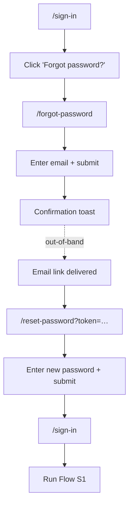

Steps:
1. From `/sign-in` → click "Forgot password?" → `/forgot-password`.
2. Enter email → submit → confirmation toast.
3. (Out-of-band) receive email link → land on `/reset-password?token=…`.
4. Enter new password → submit → redirect to `/sign-in`.
5. Run Flow S1.

Routes touched: `/forgot-password`, `/reset-password`, `/sign-in`
Permissions required: none

---

### Flow S3 — Idle session expiry

**Role:** any
**Trigger:** No interaction past the idle timeout
**Outcome:** Auto-signed-out with `reason: 'session_expired'`; redirected to `/sign-in`

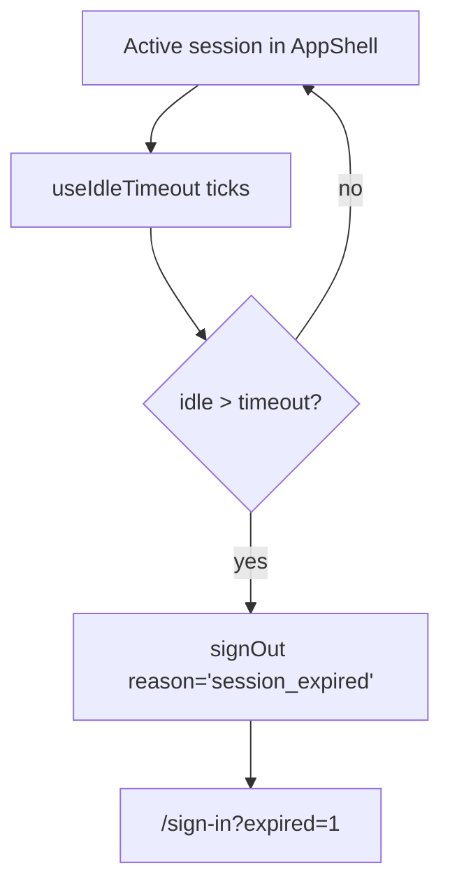

Mechanism: `useIdleTimeout()` in `AuthGuard` ([src/router.tsx:131-134](../src/router.tsx)). Not a user-initiated flow but the only end-of-session path other than explicit sign-out.

---

### Flow S4 — Open a Coming-Soon feature

**Role:** any
**Trigger:** Click a 🔒 sidebar item or a billing-upgrade CTA
**Outcome:** Lands on `/locked/:feature` with title, bullets, screenshot, and a `mailto:` contact CTA

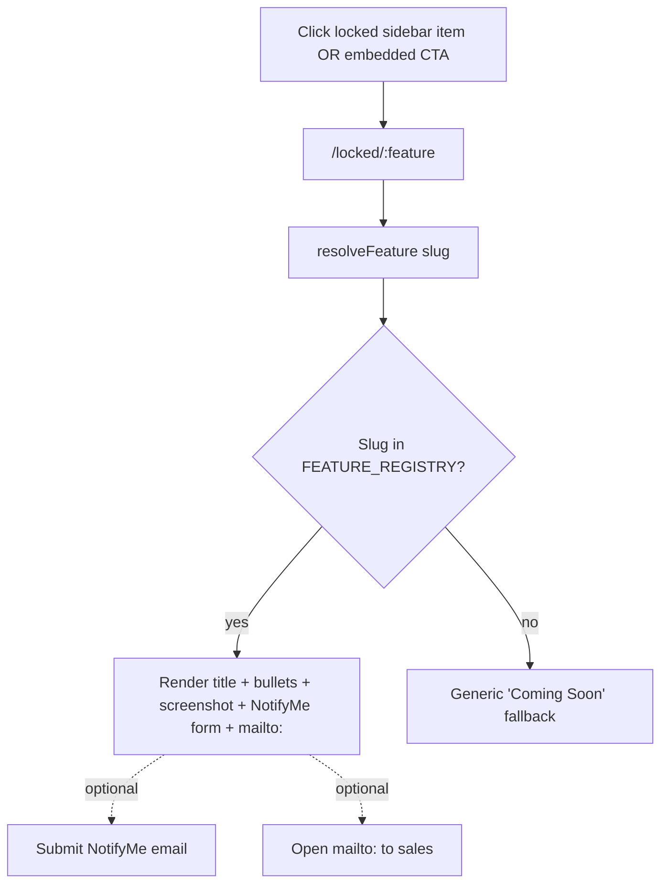

Slug → content map: [src/features/coming-soon/data/featureContent.ts](../src/features/coming-soon/data/featureContent.ts) (`FEATURE_REGISTRY`).

Routes touched: `/locked/:feature`
Permissions required: none

---

## 3. Owner flows

The Owner is the only role with `staff.write`, `settings.write`, `audit.write`, and full `destructive` rights across every resource. In practice, the Owner also owns onboarding, billing, and integrations.

### Flow O1 — First-run onboarding

**Role:** owner
**Trigger:** First sign-in on a fresh institution (`onboardingComplete === false`)
**Outcome:** Institution configured; `User.onboardingComplete` flips to `true`; lands on `/`

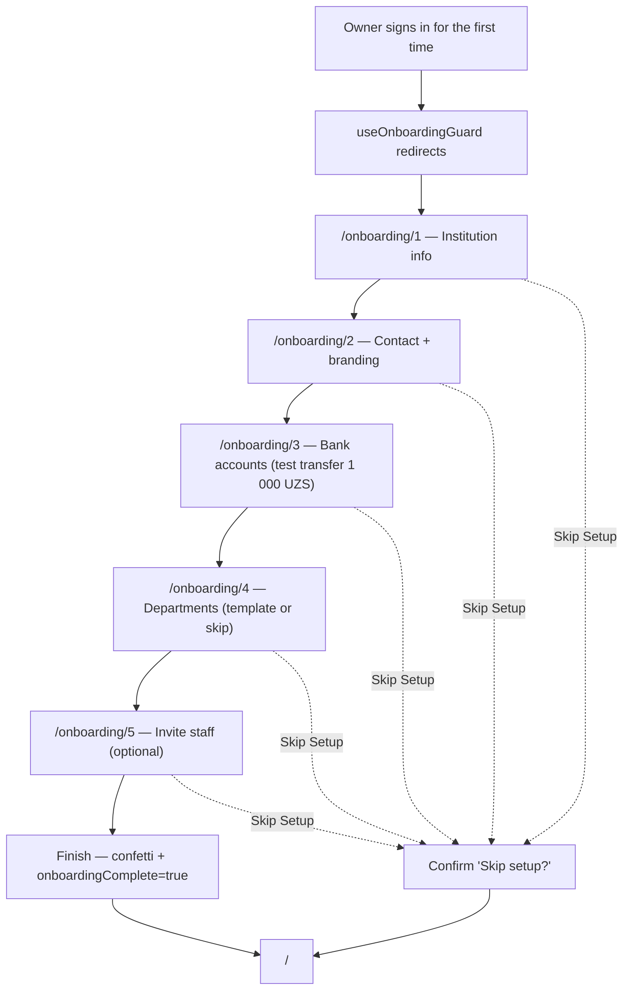

Steps (sequential — `StepGuardedSwitch` in [OnboardingPage.tsx:43-72](../src/features/onboarding/pages/OnboardingPage.tsx) refuses skips):
1. `/onboarding/1` — **Institution info** — name (RU/UZ), type, legal form, TIN, region, address, website, founded year.
2. `/onboarding/2` — **Contact + branding** — contact email, phone, logo upload, primary color, receipt footer (with live receipt preview).
3. `/onboarding/3` — **Bank accounts** — add ≥1 account; one marked default. UNIPAY sends a 1 000 UZS test transfer for verification.
4. `/onboarding/4` — **Departments** — pick a template (university / school / kindergarten) or skip; edit tree via dnd-kit.
5. `/onboarding/5` — **Invite staff** (optional) — invite by email + role; "Skip and finish" exits without invites. Confetti on finish.

Sidebar is locked throughout (tooltip: `onboarding.sidebarLockedTooltip`). "Skip Setup" exit is available on every step (sets `onboardingComplete = true` and routes to `/`).

Routes touched: `/onboarding/1` … `/onboarding/5`, `/`
Permissions required: implicit (Owner is the only role with `onboardingComplete: false`)
Open questions: invite email body content (PRD-only).

---

### Flow O2 — Invite a staff member

**Role:** owner *(Finance Manager also accepted today — see footnote 1 in [INFORMATION_ARCHITECTURE.md §4](./INFORMATION_ARCHITECTURE.md))*
**Trigger:** New hire needs dashboard access
**Outcome:** Invite email sent; row appears in Staff list with `pending` status

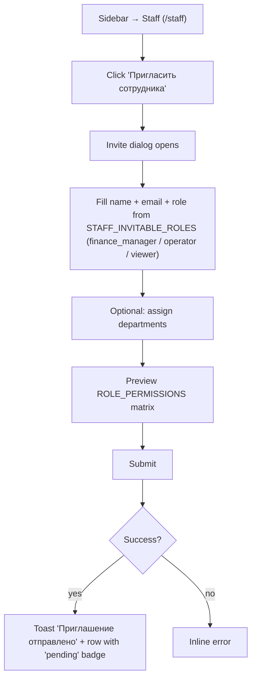

Steps:
1. Sidebar → **Staff** (`/staff`).
2. Click "Пригласить сотрудника" → invite dialog.
3. Fill name, email, role from `STAFF_INVITABLE_ROLES = ['finance_manager', 'operator', 'viewer']` (Owner cannot be invited — only transferred).
4. Optional: assign departments; preview permission matrix from `ROLE_PERMISSIONS`.
5. Submit → toast "Приглашение отправлено" → row appears with `pending` badge.

Routes touched: `/staff`
Permissions required: `staff.write` (per spec: Owner only)
Open questions: invite email content; expiry / resend cadence.

---

### Flow O3 — Configure the organization end-to-end

**Role:** owner
**Trigger:** Update institution details after onboarding (e.g. new bank account, rebrand, new department)
**Outcome:** Org profile reflects the change; receipts and reports use the new values

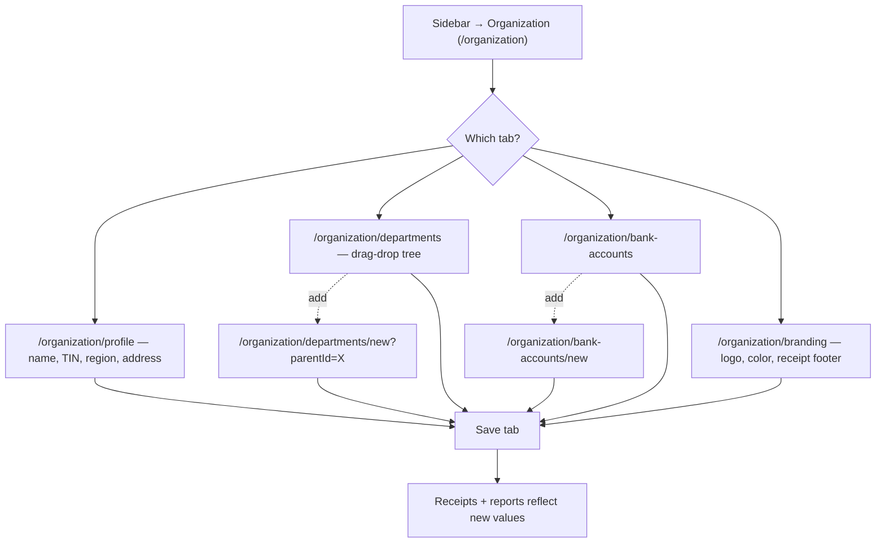

Steps:
1. Sidebar → **Organization** (`/organization`).
2. Walk the 4 tabs in order or as needed:
   - **Profile** (`/organization/profile`) — name, type, TIN, region, address, website.
   - **Departments** (`/organization/departments`) — drag-and-drop tree edit; add child via `/organization/departments/new`.
   - **Bank Accounts** (`/organization/bank-accounts`) — add via `/organization/bank-accounts/new`; mark default; verification status flips after server-side test transfer.
   - **Branding** (`/organization/branding`) — logo, primary color, receipt footer; live receipt preview.
3. Each tab saves independently; cross-tab consistency is the user's responsibility.

Routes touched: `/organization/*`
Permissions required: `settings.write` (per spec: Owner only)

---

### Flow O4 — Audit + security review

**Role:** owner
**Trigger:** Periodic governance check; suspected access incident
**Outcome:** Audit log reviewed; sessions revoked or 2FA enforced as needed

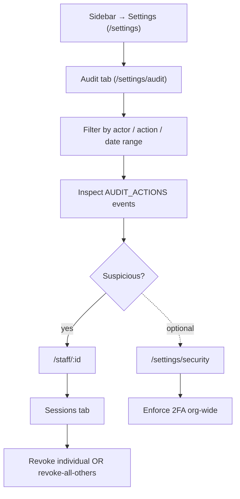

Steps:
1. Sidebar → **Settings** (`/settings`) → **Audit** tab (`/settings/audit`).
2. Filter by actor / action / date range; inspect specific events from `AUDIT_ACTIONS` (e.g. `staff.role_changed`, `apikey.revealed`, `payment.refunded`).
3. If suspicious, open **Staff** (`/staff/:id`) → **Sessions** tab → revoke individual sessions or "revoke all others".
4. Optional: enforce 2FA org-wide via `/settings/security`.

Routes touched: `/settings/audit`, `/settings/security`, `/staff/:id`
Permissions required: `audit.read`, `staff.write` (per spec: Owner only)

---

### Flow O5 — Manage billing + plan

**Role:** owner
**Trigger:** Plan upgrade needed; commission rate review
**Outcome:** Plan changed; billing reflects new monthly fee + commission

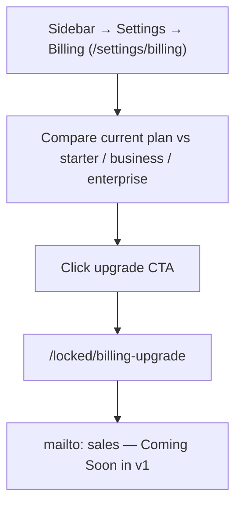

Steps:
1. Sidebar → **Settings** → **Billing** (`/settings/billing`).
2. Compare current plan against `starter` / `business` / `enterprise` (from `BillingPlanInfo`).
3. Click upgrade CTA → routes to `/locked/billing-upgrade` (Coming Soon — current v1 surfaces a `mailto:` to sales).

Routes touched: `/settings/billing`, `/locked/billing-upgrade`
Permissions required: `settings.write` (per spec: Owner only)

---

## 4. Finance Manager flows

The Finance Manager owns money in/out: refunds, payouts, monthly reconciliation, and reports. They have `payments.destructive` (can refund) but not `staff.write` (per spec) or `settings.write`.

### Flow F1 — Monthly reconciliation

**Role:** finance_manager
**Trigger:** End-of-month close
**Outcome:** Month's revenue + commissions + payouts reconciled; export filed

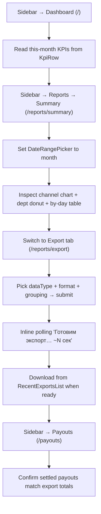

Steps:
1. Sidebar → **Dashboard** (`/`) — read this-month KPI from `<KpiRow>` (`monthRevenue`, `pending`, `overdue`).
2. Sidebar → **Reports** → **Summary** (`/reports/summary`) — set date range to the month via `<DateRangePicker>`. Inspect the channel mix bar chart and department donut.
3. Drill into the per-day table; sort/paginate; mobile-card render on phones.
4. Switch to **Export** tab (`/reports/export`) — pick `dataType` (transactions / payouts / refunds / students), format, grouping → submit. Status polls inline (`Готовим экспорт… ~N сек`).
5. Download from `<RecentExportsList>` once `ready` (3-second mock turnaround).
6. Sidebar → **Payouts** (`/payouts`) — confirm the month's settled payouts match the export totals.

Routes touched: `/`, `/reports/summary`, `/reports/export`, `/payouts`
Permissions required: `reports.read`, `reports.write` (export creation), `payments.read`

---

### Flow F2 — Process a refund

**Role:** finance_manager *(Owner also)*
**Trigger:** Customer disputes a charge; duplicate payment; service not provided
**Outcome:** Refund row in `pending → approved → completed` lifecycle; transaction `refunded`

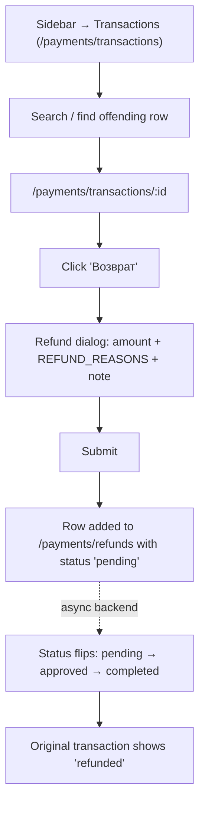

Steps:
1. Sidebar → **Transactions** (`/payments/transactions`) → search/find the offending row.
2. Open `/payments/transactions/:id` → click "Возврат" → refund dialog.
3. Fill amount (default = full amount), reason from `REFUND_REASONS = ['duplicate', 'wrong_amount', 'service_not_provided', 'other']`, note.
4. Submit → row added to **Refunds** (`/payments/refunds`) with `pending` status.
5. (Async) backend approves → status `completed`; original transaction shows `refunded`.

Routes touched: `/payments/transactions`, `/payments/transactions/:id`, `/payments/refunds`
Permissions required: `payments.destructive` (Owner + Finance Manager only)

---

### Flow F3 — Request a payout

**Role:** finance_manager *(Owner also)*
**Trigger:** Available balance ≥100k UZS and `balance.plan === 'request'`
**Outcome:** Payout row created with `pending` status; settles via async backend

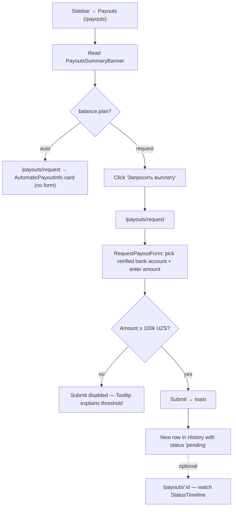

Steps:
1. Sidebar → **Payouts** (`/payouts`).
2. Read the summary banner: received-this-month / last / next-expected.
3. If plan is `auto`, the Request CTA is hidden — `/payouts/request` shows `<AutomaticPayoutInfo>` instead. Stop here.
4. If plan is `request`, click "Запросить выплату" → `/payouts/request`.
5. Fill the `<RequestPayoutForm>`: pick a verified bank account, enter amount (Tooltip on submit if <100k UZS).
6. Submit → toast → row appears in History with `pending` status.
7. Optional: open `/payouts/:id` to watch the 4-step `<StatusTimeline>` (Created → Processing → Settled → Reconciled).

Routes touched: `/payouts`, `/payouts/request`, `/payouts/:id`
Permissions required: `payments.write` (Owner + Finance Manager + Operator have `payments.write`; payout-specific gating is currently UI-only)

---

### Flow F4 — Confirm or cancel a pending payout

**Role:** finance_manager *(Owner also)*
**Trigger:** A payout sits in `pending` and needs human approval/rejection
**Outcome:** Payout transitions to `processing` (confirm) or stays `pending` cancelled (cancel)

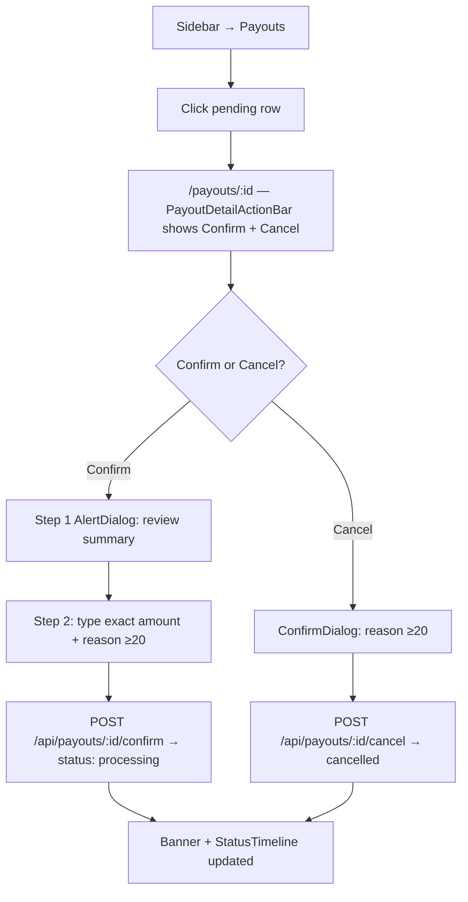

Steps:
1. Sidebar → **Payouts** → click the pending row.
2. On `/payouts/:id`, the `<PayoutDetailActionBar>` surfaces Confirm + Cancel.
3. **Confirm:** 2-step `<AlertDialog>` — type the exact amount + reason ≥20 chars. Submit → `POST /api/payouts/:id/confirm`.
4. **Cancel:** destructive `ConfirmDialog` with reason ≥20 chars. Submit → `POST /api/payouts/:id/cancel`.
5. Banner reflects new status; timeline marker updates.

Routes touched: `/payouts/:id`
Permissions required: `payments.destructive` (cancel) / `payments.write` (confirm)

---

## 5. Operator flows

The Operator works front-line: adding students, recording payments, chasing overdues. They have `students.write` and `payments.write` but no `destructive` and no `settings`/`audit` access.

### Flow OP1 — Add a single student

**Role:** operator *(Owner + Finance Manager + Operator)*
**Trigger:** New student enrolled
**Outcome:** Student record exists; appears in Students list

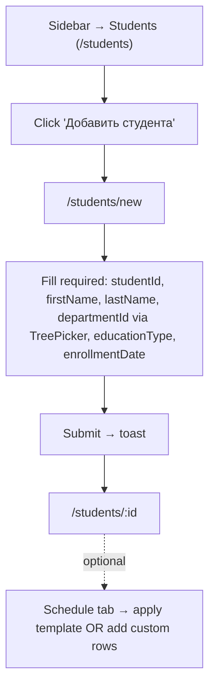

Steps:
1. Sidebar → **Students** (`/students`).
2. Click "Добавить студента" → `/students/new`.
3. Fill required fields: studentId, firstName, lastName, departmentId (via `<TreePicker>`), educationType, enrollmentDate.
4. Submit → toast → redirected to `/students/:id`.
5. Optional: switch to **Schedule** tab → apply a template OR add custom rows.

Routes touched: `/students`, `/students/new`, `/students/:id`
Permissions required: `students.write`

---

### Flow OP2 — Bulk import students from xlsx

**Role:** operator *(Owner + Finance Manager + Operator)*
**Trigger:** Term start; multi-hundred student batch from registrar
**Outcome:** Cleaned batch committed to Students list

```mermaid
flowchart TD
  A["Sidebar → Students → Импорт"] --> B["/students/import"]
  B --> C[Step 1: download xlsx template]
  C --> D[Step 1: upload completed file]
  D --> E[Step 2: review + correct column mapping]
  E --> F[Step 3: server-parsed rows with per-cell errors]
  F --> G{All rows clean?}
  G -->|no| H[Inline-edit OR download error report]
  H --> F
  G -->|yes| I[Step 4: commit]
  I --> J{committed > 100?}
  J -->|yes| K[Reason ≥20 required]
  K --> L[Submit → batch created]
  J -->|no| L
  L --> M[/students — new rows visible]
```

Steps (4 internal wizard steps):
1. Sidebar → **Students** → "Импорт" → `/students/import`.
2. **Step 1 — Upload** — download xlsx template; upload completed file.
3. **Step 2 — Map** — auto-detected columns; correct any field-mapping errors.
4. **Step 3 — Review** — server-parsed rows with per-cell errors (`ImportRow.errors`); inline-edit until clean. Download error report (xlsx).
5. **Step 4 — Commit** — if committed count >100, reason ≥20 chars required → submit → batch created.

Routes touched: `/students/import`, `/students`
Permissions required: `students.write`
Open questions: behavior on duplicate `studentId` against existing records (planted in fixture; flow may differ in production).

---

### Flow OP3 — Resolve an overdue payment

**Role:** operator *(Owner + Finance Manager + Operator)*
**Trigger:** Overdue alert fires (per `NotificationPreferences.overdueAlertDays`)
**Outcome:** Payment recorded as paid OR reminder sent OR rescheduled

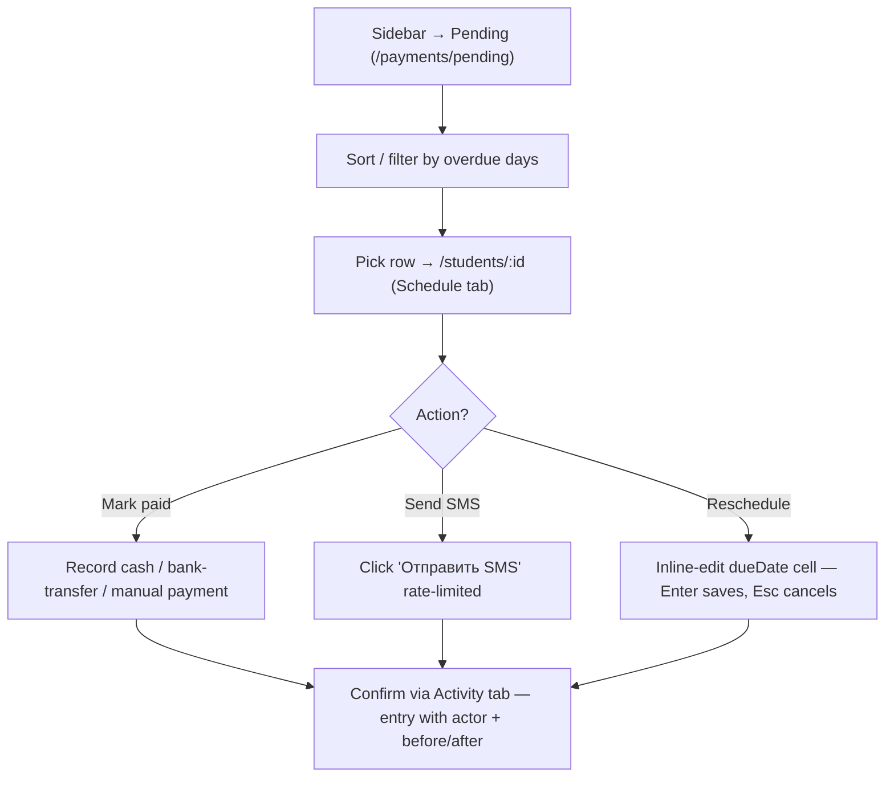

Steps:
1. Sidebar → **Pending** (`/payments/pending`).
2. Sort/filter by overdue days; pick a row → `/students/:id` (Schedule tab).
3. Either:
   - **Mark paid manually** — record a Cash / Bank transfer / Other payment via the action bar (channel = `cash | manual`).
   - **Send SMS reminder** — click "Отправить SMS" in the action bar (rate-limited).
   - **Reschedule** — inline-edit the schedule row's dueDate (Enter to save, Esc to cancel).
4. Confirm via the **Activity** tab (`student.activity`) — entry appears with actor + before/after.

Routes touched: `/payments/pending`, `/students/:id`
Permissions required: `students.write`, `payments.write`
⚠️ Spec only: SMS Campaigns module is **Coming Soon**; per-student SMS works today.

---

### Flow OP4 — Apply a payment schedule template

**Role:** operator *(Owner + Finance Manager + Operator)*
**Trigger:** New term; tuition schedule needs rolling out
**Outcome:** ScheduleRows generated for the target cohort

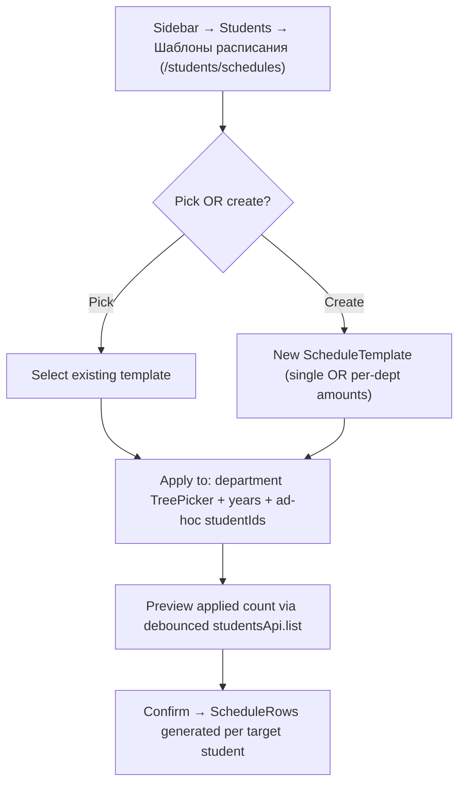

Steps:
1. Sidebar → **Students** → "Шаблоны расписания" (`/students/schedules`).
2. Pick a template OR create one (`<ScheduleTemplate>`: single amount or per-department amounts).
3. Apply to: department selection (`<TreePicker>` multi-select with subtree toggle) + years + ad-hoc studentIds.
4. Preview applied count; confirm → ScheduleRows generated for each target student.

Routes touched: `/students/schedules`
Permissions required: `students.write`

---

## 6. Viewer flows

Viewer is read-only across the resources they can access (`students`, `payments`, `reports`, `staff`). No write, no destructive, no `settings`, no `audit`.

### Flow V1 — Daily morning check

**Role:** viewer
**Trigger:** Start of business day
**Outcome:** Awareness of yesterday's revenue, pending balance, overdue queue

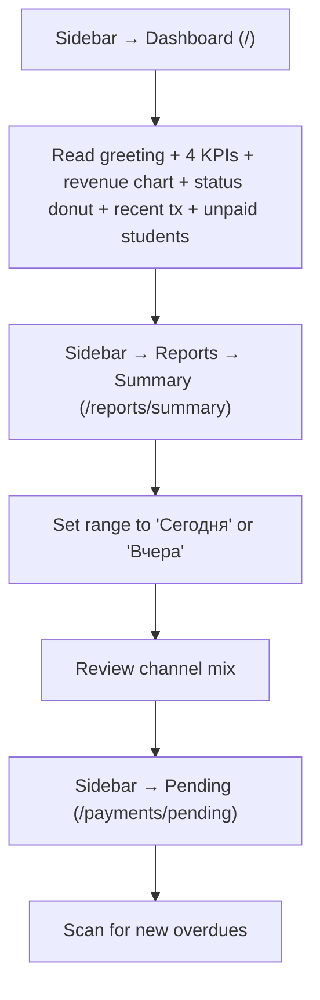

Steps:
1. Sidebar → **Dashboard** (`/`) — read greeting + 4 KPIs + revenue chart + payment status donut + recent transactions + unpaid students.
2. Sidebar → **Reports** → **Summary** (`/reports/summary`) — set range to "Сегодня" or "Вчера" → review channel mix.
3. Sidebar → **Pending** (`/payments/pending`) — scan for new overdues.

Routes touched: `/`, `/reports/summary`, `/payments/pending`
Permissions required: `students.read`, `payments.read`, `reports.read`

---

### Flow V2 — Look up a student's payment history

**Role:** viewer *(any role with `students.read`)*
**Trigger:** Parent inquiry; registrar question
**Outcome:** Visibility into a specific student's schedule + transactions

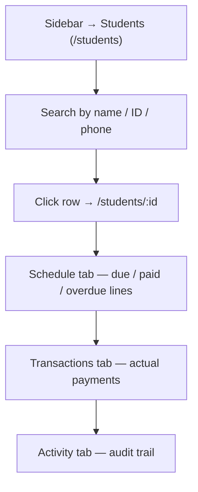

Steps:
1. Sidebar → **Students** (`/students`) → search by name / ID / phone.
2. Click row → `/students/:id`.
3. Read the **Schedule** tab for due / paid / overdue lines.
4. Switch to **Transactions** tab to see actual payments (channel, amount, status).
5. Switch to **Activity** tab for the audit trail of who changed what.

Routes touched: `/students`, `/students/:id`
Permissions required: `students.read`

---

### Flow V3 — Pull a report for a stakeholder

**Role:** viewer
**Trigger:** Director asks for a department-level breakdown
**Outcome:** Report visible on screen; export request submitted (if Reports.write enforced)

```mermaid
flowchart TD
  A["Sidebar → Reports → Summary (/reports/summary)"] --> B[Set date range]
  B --> C[Read department donut + per-day table]
  C --> D["/reports/export"]
  D --> E{Viewer has reports.write?}
  E -->|spec: no| F[Backend will reject POST when wired up]
  E -->|today by URL| G[Form reachable, submit will fail]
```

Steps:
1. Sidebar → **Reports** → **Summary** (`/reports/summary`).
2. Set date range; read department donut + per-day table.
3. (Spec) Export tab requires `reports.write` — Viewer is `read` only.
4. ⚠️ Today the Export tab is reachable by URL for Viewer; backend will reject the POST when wired up.

Routes touched: `/reports/summary`, `/reports/export`
Permissions required: `reports.read`
⚠️ Spec only: write-side `/reports/export` enforcement.

---

## 7. Cross-cutting interactions (any role)

### Switch language

1. User menu (top-right) → "Язык" / "Til" → select RU / UZ → page reloads in the chosen locale (`User.locale` updated).

### Switch theme

1. Top bar → theme toggle → light / dark / system.

### Sign out

1. User menu → "Выйти" → `signOut({ reason: 'manual' })` → redirected to `/sign-in`.

### Open a Coming-Soon feature

See [Flow S4](#flow-s4--open-a-coming-soon-feature).

### Hit `/system/preview/*`

QA-only; not part of any user flow. See [INFORMATION_ARCHITECTURE.md §3](./INFORMATION_ARCHITECTURE.md).

---

## 8. Maintenance contract

Add a flow here when:
- A new module ships and a role's job-to-be-done changes.
- A role gains/loses a capability that opens up a new workflow.
- A flow that was Spec-only (`⚠️`) gains its enforcement and becomes real.

Remove a flow when:
- The feature is removed.
- The flow no longer matches what's in [src/router.tsx](../src/router.tsx) or `ROLE_PERMISSIONS`.

Cross-checks before merging:
1. Every step in every flow points to a route that exists in [src/router.tsx](../src/router.tsx).
2. Every "Permissions required" line cites a real `(resource, action)` pair from `ROLE_PERMISSIONS`.
3. No flow uses a status name not in [src/types/domain.ts](../src/types/domain.ts).
4. The IA tree in [INFORMATION_ARCHITECTURE.md §3](./INFORMATION_ARCHITECTURE.md) has not gained or lost routes that aren't reflected here.
