# UNIPAY — Пользовательские сценарии по ролям

> Канонические сквозные сценарии для каждой из 4 ролей панели.
> Карту маршрутов и матрицу видимости по ролям смотрите в [INFORMATION_ARCHITECTURE.md](./INFORMATION_ARCHITECTURE.md).

Этот документ — **карта рабочих процессов**, а не руководство пользователя. Каждый сценарий описывает последовательность экранов, через которые проходит роль, выполняя одну конкретную задачу: какие маршруты затрагиваются и какая строка матрицы прав это разрешает.

---

## Как читать сценарий

Каждый сценарий начинается с **диаграммы mermaid `flowchart TD`** для быстрого визуального обзора, после чего идёт текстовый разбор. Диаграмма и шаги синхронизированы — если они расходятся, приоритет у шагов (они ссылаются на реальный маршрут и строку прав).

```markdown
### Сценарий X — Краткое название

**Роль:** Владелец / Финансовый менеджер / Оператор / Наблюдатель *(в коде: `owner` / `finance_manager` / `operator` / `viewer`)*
**Что запускает:** Что побуждает пользователя начать сценарий
**Результат:** Что становится правдой после завершения

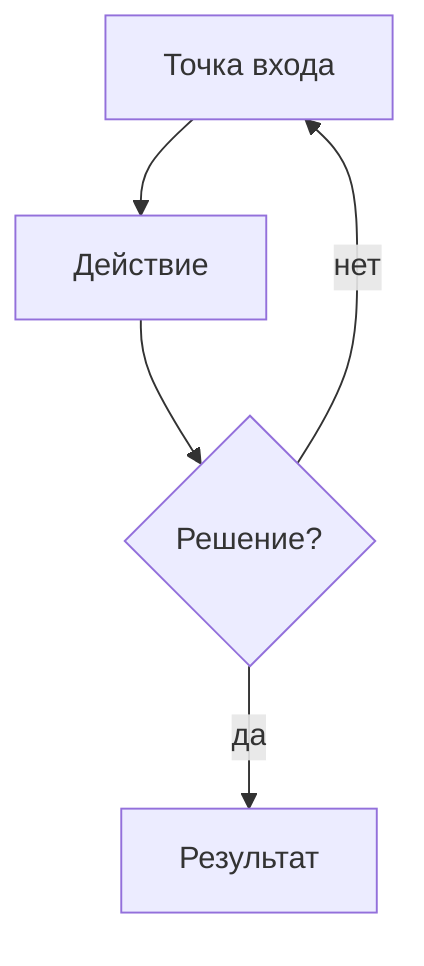

Шаги:
1. Сайдбар → … (`/route`)
2. Клик "…" → следующий экран
3. …

Затронутые маршруты: `/route`, `/route/:id`
Требуются права: `resource.action` по `ROLE_PERMISSIONS`
Открытые вопросы: что не решено (PRD-only, не в коде)
```

**Соглашения для диаграмм** —
- `[Прямоугольник]` = действие / страница
- `{Ромб?}` = ветвление по решению
- `-->` = основное ребро · `-. метка .->` = опциональное / асинхронное / внешнее ребро
- Маршруты пишутся как есть (например, `/staff/:id`); то же для ресурсов `ROLE_PERMISSIONS`

Если сценарий **специфицирован, но ещё не закреплён** в рантайме (например, маршрут есть, но `RoleGuard` не скрывает его от Наблюдателя), он помечен **⚠️ Только спека**.

---

## 1. 4 роли коротко

| Роль *(в коде)* | Основная задача | Онбординг |
|---|---|---|
| **Владелец** *(`owner`)* | Настроить учреждение и управлять доступом, тарифом, аудитом | Мастер первичной настройки |
| **Финансовый менеджер** *(`finance_manager`)* | Сверка денежных потоков: платежи, возвраты, выплаты, отчёты | Пропускает онбординг |
| **Оператор** *(`operator`)* | Фронтлайн-работа: студенты, платежи, просрочки, напоминания | Пропускает онбординг |
| **Наблюдатель** *(`viewer`)* | Только чтение: дашборды, отчёты, поиск студентов | Пропускает онбординг |

DEV-фикстуры в [src/lib/auth.ts:69-98](../src/lib/auth.ts) подтверждают: только `owner@unipay.dev` поставляется с `onboardingComplete: false`.

---

## 2. Общие сценарии (применимы к любой роли)

### Сценарий S1 — Вход

**Роль:** любая
**Что запускает:** Пользователь открывает URL панели, не имея активной сессии
**Результат:** Аутентифицированная сессия; перешёл на `/` (или `/onboarding/:step`, если Владелец не закончил онбординг)

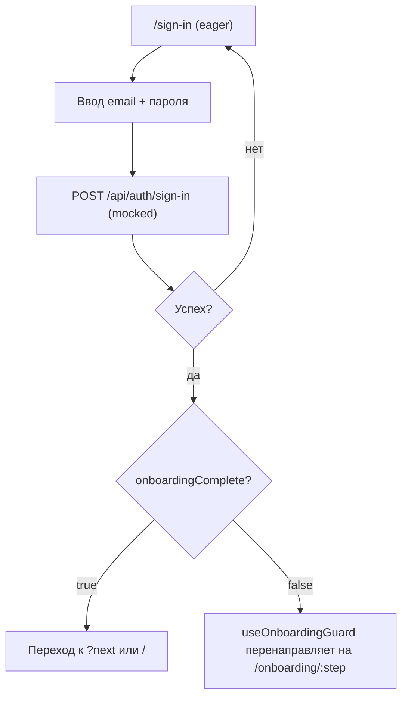

Шаги:
1. Попадает на `/sign-in` (eager-loaded; без вспышки скелетона).
2. Ввод email + пароля (DEV: роль определяется по префиксу email или домену).
3. Submit → `POST /api/auth/sign-in` (mocked).
4. При успехе — переход на `next` query-param, иначе на `/`.
5. Если `profile.onboardingComplete === false`, `useOnboardingGuard()` перенаправляет на `/onboarding/:step`.

Затронутые маршруты: `/sign-in`, `/`, `/onboarding/:step`
Требуются права: нет (публичная поверхность)

---

### Сценарий S2 — Забыли + сброс пароля

**Роль:** любая
**Что запускает:** Пользователь забыл пароль
**Результат:** Новый пароль установлен; вход через сценарий S1

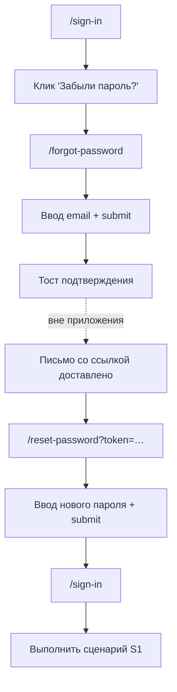

Шаги:
1. С `/sign-in` → клик "Забыли пароль?" → `/forgot-password`.
2. Ввод email → submit → тост подтверждения.
3. (Вне приложения) приходит письмо со ссылкой → переход на `/reset-password?token=…`.
4. Ввод нового пароля → submit → редирект на `/sign-in`.
5. Выполнить сценарий S1.

Затронутые маршруты: `/forgot-password`, `/reset-password`, `/sign-in`
Требуются права: нет

---

### Сценарий S3 — Истечение сессии по неактивности

**Роль:** любая
**Что запускает:** Нет взаимодействия дольше таймаута неактивности
**Результат:** Автоматический выход с `reason: 'session_expired'`; редирект на `/sign-in`

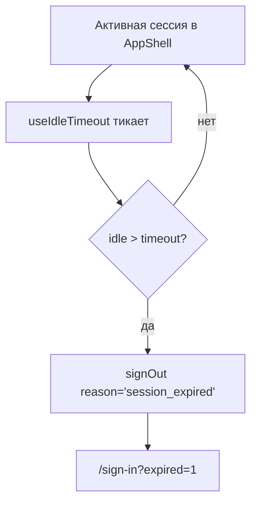

Механизм: `useIdleTimeout()` внутри `AuthGuard` ([src/router.tsx:131-134](../src/router.tsx)). Это не пользователь-инициируемый сценарий, но единственный путь завершения сессии, кроме явного выхода.

---

### Сценарий S4 — Открыть Coming Soon фичу

**Роль:** любая
**Что запускает:** Клик по 🔒 пункту сайдбара или по CTA "обновить тариф"
**Результат:** Попадает на `/locked/:feature` с заголовком, буллетами, скриншотом и `mailto:` CTA для связи

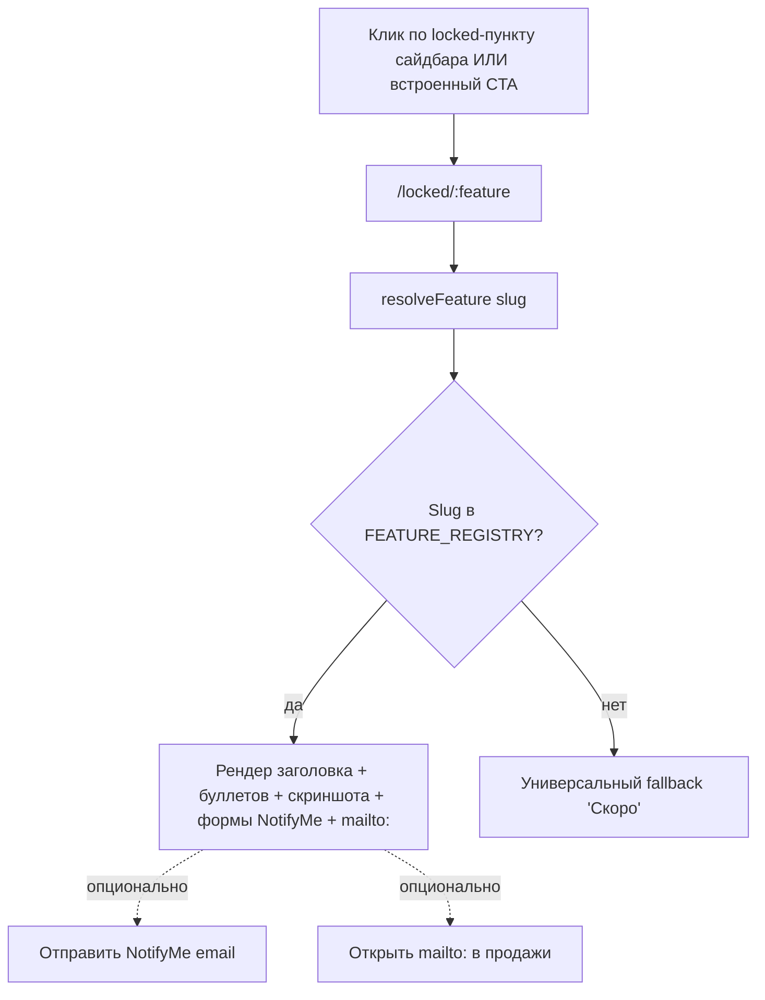

Карта slug → контент: [src/features/coming-soon/data/featureContent.ts](../src/features/coming-soon/data/featureContent.ts) (`FEATURE_REGISTRY`).

Затронутые маршруты: `/locked/:feature`
Требуются права: нет

---

## 3. Сценарии Владельца

Только у Владельца есть `staff.write`, `settings.write`, `audit.write` и полный `destructive` по всем ресурсам. На практике Владелец также отвечает за онбординг, тариф и интеграции.

### Сценарий O1 — Первичная настройка

**Роль:** Владелец *(`owner`)*
**Что запускает:** Первый вход в свежем учреждении (`onboardingComplete === false`)
**Результат:** Учреждение настроено; `User.onboardingComplete` становится `true`; переход на `/`

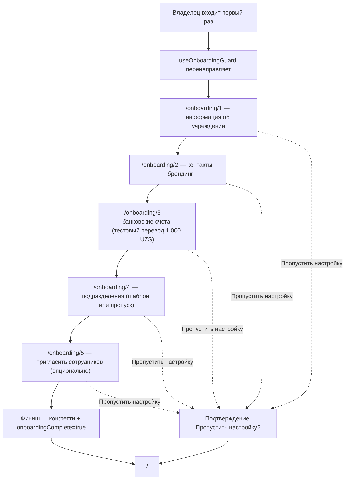

Шаги (последовательно — `StepGuardedSwitch` в [OnboardingPage.tsx:43-72](../src/features/onboarding/pages/OnboardingPage.tsx) запрещает пропуски):
1. `/onboarding/1` — **Информация об учреждении** — название (RU/UZ), тип, правовая форма, ИНН, регион, адрес, сайт, год основания.
2. `/onboarding/2` — **Контакты + брендинг** — контактный email, телефон, загрузка логотипа, основной цвет, подпись на чеке (с live-превью чека).
3. `/onboarding/3` — **Банковские счета** — добавить ≥1 счёт; один помечен дефолтным. UNIPAY делает тестовый перевод 1 000 UZS для верификации.
4. `/onboarding/4` — **Подразделения** — выбрать шаблон (университет / школа / детсад) или пропустить; редактирование дерева через dnd-kit.
5. `/onboarding/5` — **Пригласить сотрудников** (опционально) — приглашение по email + роли; "Пропустить и завершить" выходит без приглашений. Конфетти при финише.

Сайдбар заблокирован весь онбординг (tooltip: `onboarding.sidebarLockedTooltip`). Выход "Пропустить настройку" доступен на каждом шаге (выставляет `onboardingComplete = true` и переход на `/`).

Затронутые маршруты: `/onboarding/1` … `/onboarding/5`, `/`
Требуются права: неявно (только Владелец имеет `onboardingComplete: false`)
Открытые вопросы: содержимое письма-приглашения (только PRD).

---

### Сценарий O2 — Пригласить сотрудника

**Роль:** Владелец *(`owner`)* *(Финансовый менеджер сегодня тоже принимается — см. сноску 1 в [INFORMATION_ARCHITECTURE.md §4](./INFORMATION_ARCHITECTURE.md))*
**Что запускает:** Новому сотруднику нужен доступ к панели
**Результат:** Письмо-приглашение отправлено; в списке сотрудников появилась строка со статусом `pending`

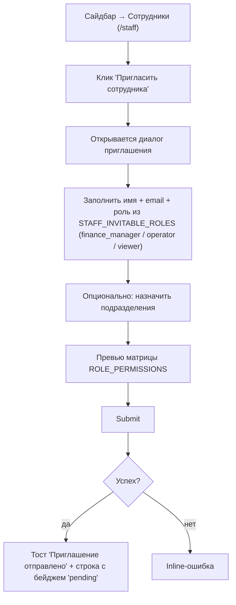

Шаги:
1. Сайдбар → **Сотрудники** (`/staff`).
2. Клик "Пригласить сотрудника" → диалог приглашения.
3. Заполнить имя, email, роль из `STAFF_INVITABLE_ROLES = ['finance_manager', 'operator', 'viewer']` (Владельца нельзя пригласить — только передать роль).
4. Опционально: назначить подразделения; превью матрицы прав из `ROLE_PERMISSIONS`.
5. Submit → тост "Приглашение отправлено" → появилась строка с бейджем `pending`.

Затронутые маршруты: `/staff`
Требуются права: `staff.write` (по спеке: только Владелец)
Открытые вопросы: содержимое письма; время жизни приглашения / повторная отправка.

---

### Сценарий O3 — Настройка организации целиком

**Роль:** Владелец *(`owner`)*
**Что запускает:** Обновить данные учреждения после онбординга (новый банковский счёт, ребрендинг, новое подразделение)
**Результат:** Профиль организации отражает изменения; чеки и отчёты используют новые значения

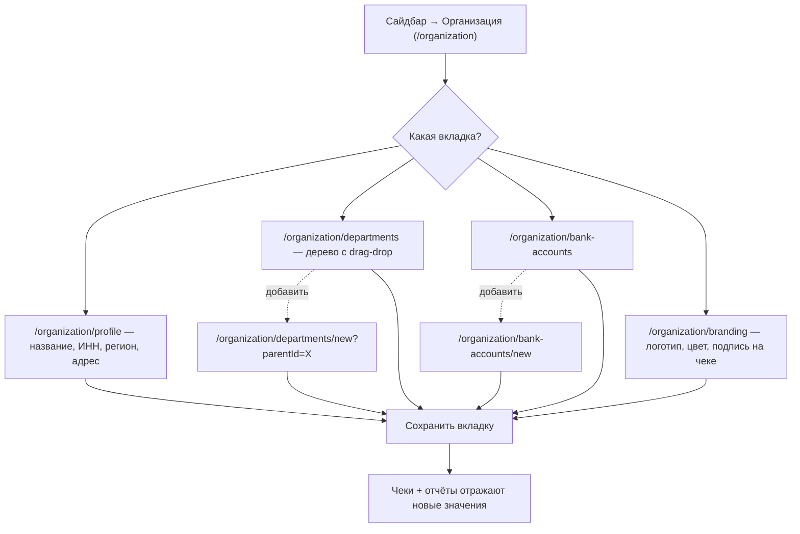

Шаги:
1. Сайдбар → **Организация** (`/organization`).
2. Пройти по 4 вкладкам по порядку или по необходимости:
   - **Профиль** (`/organization/profile`) — название, тип, ИНН, регион, адрес, сайт.
   - **Подразделения** (`/organization/departments`) — drag-drop редактирование дерева; добавление дочернего через `/organization/departments/new`.
   - **Банковские счета** (`/organization/bank-accounts`) — добавление через `/organization/bank-accounts/new`; пометка по умолчанию; статус верификации переключается после серверного тестового перевода.
   - **Брендинг** (`/organization/branding`) — логотип, основной цвет, подпись на чеке; live-превью чека.
3. Каждая вкладка сохраняется независимо; консистентность между вкладками — на пользователе.

Затронутые маршруты: `/organization/*`
Требуются права: `settings.write` (по спеке: только Владелец)

---

### Сценарий O4 — Аудит и проверка безопасности

**Роль:** Владелец *(`owner`)*
**Что запускает:** Регулярная управленческая проверка; подозрение на инцидент доступа
**Результат:** Журнал аудита просмотрен; сессии отозваны или 2FA включена при необходимости

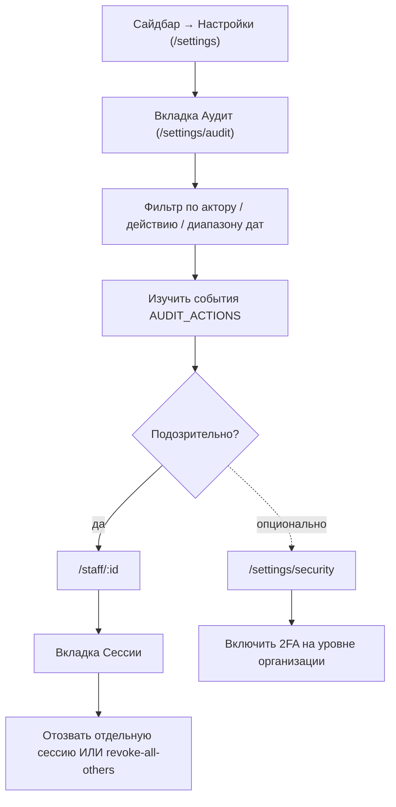

Шаги:
1. Сайдбар → **Настройки** (`/settings`) → вкладка **Аудит** (`/settings/audit`).
2. Фильтр по актору / действию / диапазону дат; изучить события из `AUDIT_ACTIONS` (например, `staff.role_changed`, `apikey.revealed`, `payment.refunded`).
3. Если подозрительно, открыть **Сотрудники** (`/staff/:id`) → вкладка **Сессии** → отозвать отдельные сессии или "revoke all others".
4. Опционально: включить 2FA на уровне организации через `/settings/security`.

Затронутые маршруты: `/settings/audit`, `/settings/security`, `/staff/:id`
Требуются права: `audit.read`, `staff.write` (по спеке: только Владелец)

---

### Сценарий O5 — Управление тарифом

**Роль:** Владелец *(`owner`)*
**Что запускает:** Нужно обновить тариф; ревизия комиссии
**Результат:** Тариф изменён; биллинг отражает новую месячную плату + комиссию

```mermaid
flowchart TD
  A["Сайдбар → Настройки → Тариф (/settings/billing)"] --> B["Сравнить текущий план с starter / business / enterprise"]
  B --> C[Клик по CTA "Улучшить план"]
  C --> D["/locked/billing-upgrade"]
  D --> E["mailto: в продажи — Coming Soon в v1"]
```

Шаги:
1. Сайдбар → **Настройки** → **Тариф** (`/settings/billing`).
2. Сравнить текущий план с `starter` / `business` / `enterprise` (из `BillingPlanInfo`).
3. Клик по CTA "Улучшить план" → переход на `/locked/billing-upgrade` (Coming Soon — в v1 это `mailto:` в продажи).

Затронутые маршруты: `/settings/billing`, `/locked/billing-upgrade`
Требуются права: `settings.write` (по спеке: только Владелец)

---

## 4. Сценарии Финансового менеджера

Финансовый менеджер отвечает за денежные потоки in/out: возвраты, выплаты, месячная сверка, отчёты. У него есть `payments.destructive` (может делать возвраты), но нет `staff.write` (по спеке) и `settings.write`.

### Сценарий F1 — Месячная сверка

**Роль:** Финансовый менеджер *(`finance_manager`)*
**Что запускает:** Закрытие месяца
**Результат:** Сверены выручка месяца + комиссии + выплаты; экспорт оформлен

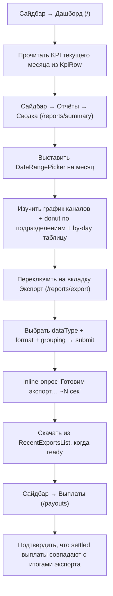

Шаги:
1. Сайдбар → **Дашборд** (`/`) — прочитать KPI текущего месяца из `<KpiRow>` (`monthRevenue`, `pending`, `overdue`).
2. Сайдбар → **Отчёты** → **Сводка** (`/reports/summary`) — выставить диапазон дат на месяц через `<DateRangePicker>`. Изучить график каналов и donut по подразделениям.
3. Углубиться в by-day таблицу; сортировать/пагинировать; mobile-card рендер на телефонах.
4. Переключиться на вкладку **Экспорт** (`/reports/export`) — выбрать `dataType` (transactions / payouts / refunds / students), формат, группировку → submit. Статус опрашивается инлайн (`Готовим экспорт… ~N сек`).
5. Скачать из `<RecentExportsList>` когда статус `ready` (3-секундный мок).
6. Сайдбар → **Выплаты** (`/payouts`) — подтвердить, что settled выплаты совпадают с итогами экспорта.

Затронутые маршруты: `/`, `/reports/summary`, `/reports/export`, `/payouts`
Требуются права: `reports.read`, `reports.write` (создание экспорта), `payments.read`

---

### Сценарий F2 — Оформить возврат

**Роль:** Финансовый менеджер *(`finance_manager`)* *(Владелец тоже)*
**Что запускает:** Клиент оспорил списание; дубль оплаты; услуга не оказана
**Результат:** Возврат в жизненном цикле `pending → approved → completed`; транзакция `refunded`

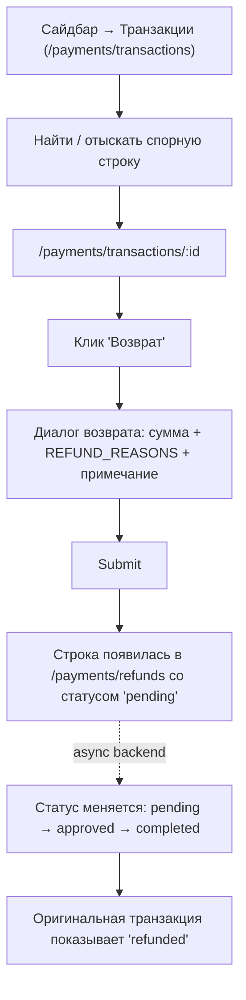

Шаги:
1. Сайдбар → **Транзакции** (`/payments/transactions`) → найти спорную строку.
2. Открыть `/payments/transactions/:id` → клик "Возврат" → диалог возврата.
3. Заполнить сумму (по умолчанию = полная сумма), причину из `REFUND_REASONS = ['duplicate', 'wrong_amount', 'service_not_provided', 'other']`, примечание.
4. Submit → строка добавлена в **Возвраты** (`/payments/refunds`) со статусом `pending`.
5. (Async) бэкенд одобряет → статус `completed`; оригинальная транзакция показывает `refunded`.

Затронутые маршруты: `/payments/transactions`, `/payments/transactions/:id`, `/payments/refunds`
Требуются права: `payments.destructive` (только Владелец + Финансовый менеджер)

---

### Сценарий F3 — Запросить выплату

**Роль:** Финансовый менеджер *(`finance_manager`)* *(Владелец тоже)*
**Что запускает:** Доступный баланс ≥100k UZS и `balance.plan === 'request'`
**Результат:** Создана строка выплаты со статусом `pending`; асинхронно settled бэкендом

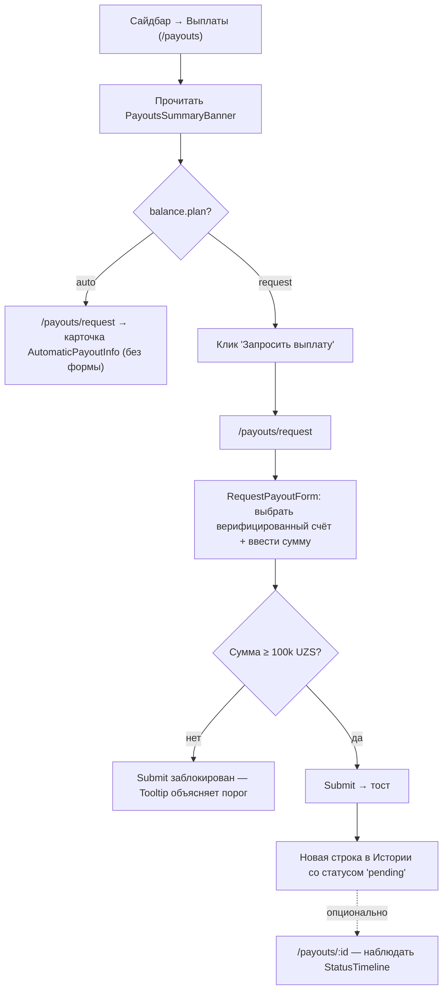

Шаги:
1. Сайдбар → **Выплаты** (`/payouts`).
2. Прочитать summary-баннер: получено за месяц / последняя / следующая ожидаемая.
3. Если план `auto`, CTA "Запросить" скрыт — `/payouts/request` показывает `<AutomaticPayoutInfo>`. Остановка.
4. Если план `request`, клик "Запросить выплату" → `/payouts/request`.
5. Заполнить `<RequestPayoutForm>`: выбрать верифицированный счёт, ввести сумму (Tooltip на submit при <100k UZS).
6. Submit → тост → строка появилась в Истории со статусом `pending`.
7. Опционально: открыть `/payouts/:id` чтобы наблюдать 4-шаговый `<StatusTimeline>` (Created → Processing → Settled → Reconciled).

Затронутые маршруты: `/payouts`, `/payouts/request`, `/payouts/:id`
Требуются права: `payments.write` (у Владельца + Финансового менеджера + Оператора есть `payments.write`; гейтинг выплат сейчас только на уровне UI)

---

### Сценарий F4 — Подтвердить или отменить ожидающую выплату

**Роль:** Финансовый менеджер *(`finance_manager`)* *(Владелец тоже)*
**Что запускает:** Выплата висит в `pending` и требует человеческого одобрения/отказа
**Результат:** Выплата переходит в `processing` (подтверждение) или остаётся `pending` отменённой

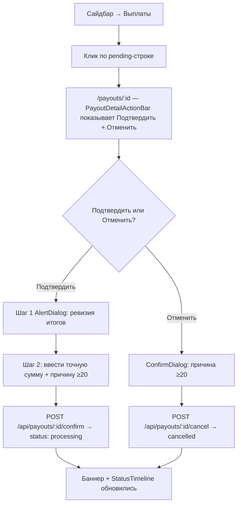

Шаги:
1. Сайдбар → **Выплаты** → клик по pending-строке.
2. На `/payouts/:id` `<PayoutDetailActionBar>` показывает Подтвердить + Отменить.
3. **Подтвердить:** 2-шаговый `<AlertDialog>` — ввести точную сумму + причину ≥20 символов. Submit → `POST /api/payouts/:id/confirm`.
4. **Отменить:** деструктивный `ConfirmDialog` с причиной ≥20 символов. Submit → `POST /api/payouts/:id/cancel`.
5. Баннер отражает новый статус; маркер таймлайна обновлён.

Затронутые маршруты: `/payouts/:id`
Требуются права: `payments.destructive` (отмена) / `payments.write` (подтверждение)

---

## 5. Сценарии Оператора

Оператор работает на передовой: добавляет студентов, фиксирует платежи, гоняет просрочки. У него есть `students.write` и `payments.write`, но нет `destructive` и доступа к `settings`/`audit`.

### Сценарий OP1 — Добавить одного студента

**Роль:** Оператор *(`operator`)* *(Владелец + Финансовый менеджер + Оператор)*
**Что запускает:** Зачислен новый студент
**Результат:** Запись студента создана; появилась в списке студентов

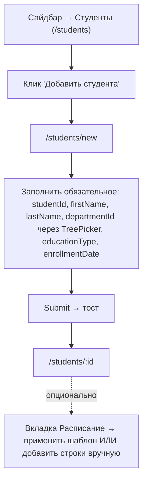

Шаги:
1. Сайдбар → **Студенты** (`/students`).
2. Клик "Добавить студента" → `/students/new`.
3. Заполнить обязательные поля: studentId, firstName, lastName, departmentId (через `<TreePicker>`), educationType, enrollmentDate.
4. Submit → тост → редирект на `/students/:id`.
5. Опционально: переключиться на вкладку **Расписание** → применить шаблон ИЛИ добавить строки вручную.

Затронутые маршруты: `/students`, `/students/new`, `/students/:id`
Требуются права: `students.write`

---

### Сценарий OP2 — Массовый импорт студентов из xlsx

**Роль:** Оператор *(`operator`)* *(Владелец + Финансовый менеджер + Оператор)*
**Что запускает:** Начало семестра; партия из нескольких сотен студентов от регистратуры
**Результат:** Очищенная партия закоммичена в список студентов

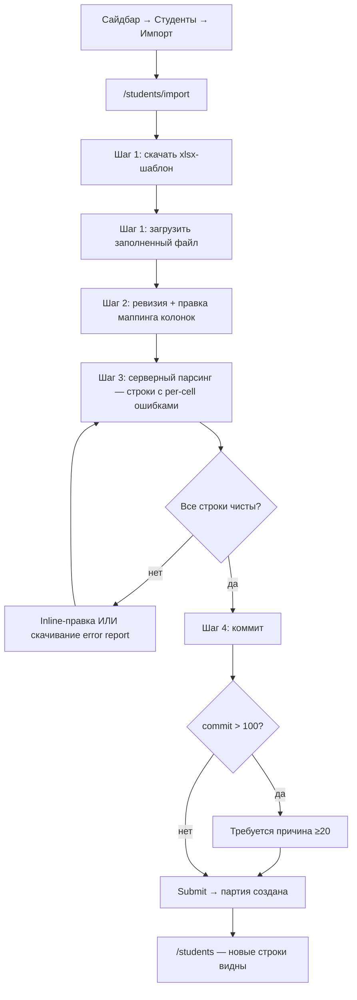

Шаги (4 внутренних шага мастера):
1. Сайдбар → **Студенты** → "Импорт" → `/students/import`.
2. **Шаг 1 — Загрузка** — скачать xlsx-шаблон; загрузить заполненный файл.
3. **Шаг 2 — Маппинг** — автодетект колонок; исправить ошибки маппинга полей.
4. **Шаг 3 — Ревизия** — серверный парсинг с per-cell ошибками (`ImportRow.errors`); inline-правка до чистоты. Скачать error report (xlsx).
5. **Шаг 4 — Коммит** — если коммит >100, требуется причина ≥20 символов → submit → партия создана.

Затронутые маршруты: `/students/import`, `/students`
Требуются права: `students.write`
Открытые вопросы: поведение при дубликате `studentId` против существующей записи (в фикстуре посажен; в продакшене может отличаться).

---

### Сценарий OP3 — Закрыть просроченный платёж

**Роль:** Оператор *(`operator`)* *(Владелец + Финансовый менеджер + Оператор)*
**Что запускает:** Сработал overdue-алерт (по `NotificationPreferences.overdueAlertDays`)
**Результат:** Платёж зафиксирован как paid ИЛИ отправлено напоминание ИЛИ перенесён срок

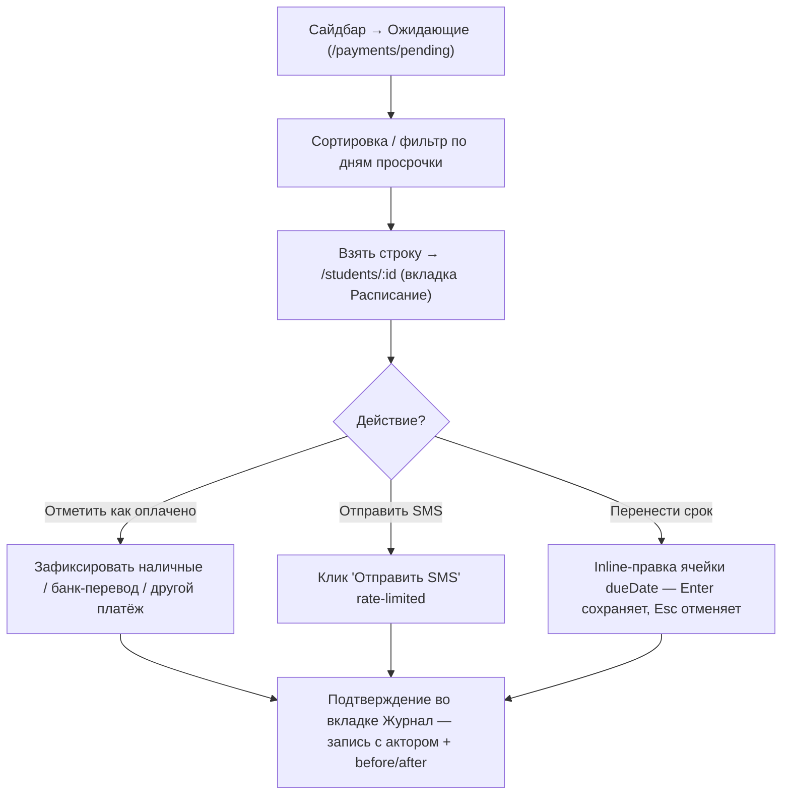

Шаги:
1. Сайдбар → **Ожидающие** (`/payments/pending`).
2. Сортировка/фильтр по дням просрочки; взять строку → `/students/:id` (вкладка Расписание).
3. Один из вариантов:
   - **Отметить как оплачено вручную** — зафиксировать Наличные / Банковский перевод / Другое через action bar (channel = `cash | manual`).
   - **Отправить SMS-напоминание** — клик "Отправить SMS" в action bar (rate-limited).
   - **Перенести срок** — inline-правка `dueDate` в строке расписания (Enter сохраняет, Esc отменяет).
4. Подтверждение через вкладку **Журнал** (`student.activity`) — появится запись с актором + before/after.

Затронутые маршруты: `/payments/pending`, `/students/:id`
Требуются права: `students.write`, `payments.write`
⚠️ Только спека: модуль SMS Campaigns — **Coming Soon**; per-student SMS уже работает.

---

### Сценарий OP4 — Применить шаблон расписания

**Роль:** Оператор *(`operator`)* *(Владелец + Финансовый менеджер + Оператор)*
**Что запускает:** Новый семестр; нужно раскатить расписание оплат
**Результат:** ScheduleRows сгенерированы для целевой когорты

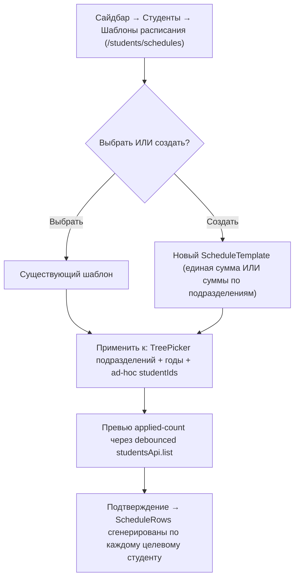

Шаги:
1. Сайдбар → **Студенты** → "Шаблоны расписания" (`/students/schedules`).
2. Выбрать шаблон ИЛИ создать (`<ScheduleTemplate>`: единая сумма или суммы по подразделениям).
3. Применить к: выбор подразделений (`<TreePicker>` multi-select с переключателем поддерева) + годы + ad-hoc studentIds.
4. Превью applied-count; подтверждение → ScheduleRows сгенерированы для каждого целевого студента.

Затронутые маршруты: `/students/schedules`
Требуются права: `students.write`

---

## 6. Сценарии Наблюдателя

Наблюдатель — только чтение по ресурсам, к которым у него есть доступ (`students`, `payments`, `reports`, `staff`). Без write, без destructive, без `settings`, без `audit`.

### Сценарий V1 — Утренняя сверка

**Роль:** Наблюдатель *(`viewer`)*
**Что запускает:** Начало рабочего дня
**Результат:** Понимание вчерашней выручки, ожидающего баланса, очереди просрочек

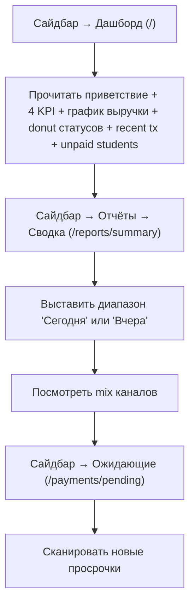

Шаги:
1. Сайдбар → **Дашборд** (`/`) — прочитать приветствие + 4 KPI + график выручки + donut статусов + recent tx + unpaid students.
2. Сайдбар → **Отчёты** → **Сводка** (`/reports/summary`) — выставить диапазон "Сегодня" или "Вчера" → посмотреть mix каналов.
3. Сайдбар → **Ожидающие** (`/payments/pending`) — сканировать новые просрочки.

Затронутые маршруты: `/`, `/reports/summary`, `/payments/pending`
Требуются права: `students.read`, `payments.read`, `reports.read`

---

### Сценарий V2 — Поиск истории платежей студента

**Роль:** Наблюдатель *(`viewer`)* *(любая роль с `students.read`)*
**Что запускает:** Запрос родителя; вопрос регистратуры
**Результат:** Видимость расписания + транзакций конкретного студента

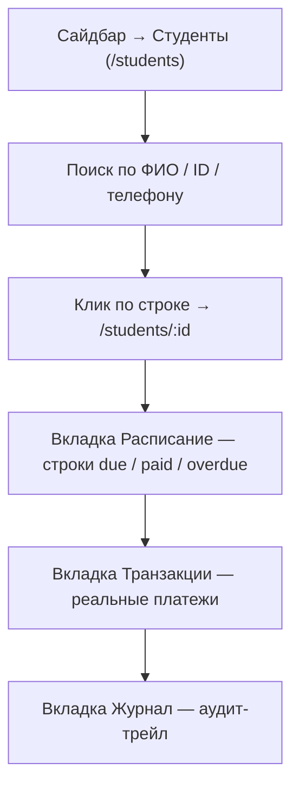

Шаги:
1. Сайдбар → **Студенты** (`/students`) → поиск по ФИО / ID / телефону.
2. Клик по строке → `/students/:id`.
3. Прочитать вкладку **Расписание** — строки due / paid / overdue.
4. Переключиться на **Транзакции** — реальные платежи (канал, сумма, статус).
5. Переключиться на **Журнал** — аудит-трейл кто что менял.

Затронутые маршруты: `/students`, `/students/:id`
Требуются права: `students.read`

---

### Сценарий V3 — Сформировать отчёт для руководства

**Роль:** Наблюдатель *(`viewer`)*
**Что запускает:** Директор просит разбивку по подразделениям
**Результат:** Отчёт виден на экране; запрос на экспорт отправлен (если `reports.write` закреплён)

```mermaid
flowchart TD
  A["Сайдбар → Отчёты → Сводка (/reports/summary)"] --> B[Выставить диапазон дат]
  B --> C[Прочитать donut подразделений + by-day таблицу]
  C --> D["/reports/export"]
  D --> E{У Наблюдателя есть reports.write?}
  E -->|по спеке: нет| F[Бэкенд отклонит POST когда будет закреплено]
  E -->|сегодня по URL| G[Форма достижима, submit упадёт]
```

Шаги:
1. Сайдбар → **Отчёты** → **Сводка** (`/reports/summary`).
2. Выставить диапазон дат; прочитать donut подразделений + by-day таблицу.
3. (Спека) вкладка **Экспорт** требует `reports.write` — у Наблюдателя только `read`.
4. ⚠️ Сегодня вкладка Экспорт достижима по URL для Наблюдателя; бэкенд отклонит POST когда это будет закреплено.

Затронутые маршруты: `/reports/summary`, `/reports/export`
Требуются права: `reports.read`
⚠️ Только спека: закрепление write-стороны `/reports/export`.

---

## 7. Сквозные взаимодействия (любая роль)

### Переключение языка

1. Меню пользователя (правый верх) → "Язык" / "Til" → выбрать RU / UZ → страница перезагружается на выбранной локали (`User.locale` обновлён).

### Переключение темы

1. Топбар → переключатель темы → светлая / тёмная / системная.

### Выход

1. Меню пользователя → "Выйти" → `signOut({ reason: 'manual' })` → редирект на `/sign-in`.

### Открытие Coming Soon фичи

См. [Сценарий S4](#сценарий-s4--открыть-coming-soon-фичу).

### Попадание на `/system/preview/*`

Только для QA; не часть пользовательского сценария. См. [INFORMATION_ARCHITECTURE.md §3](./INFORMATION_ARCHITECTURE.md).

---

## 8. Регламент сопровождения

Добавляйте сценарий сюда, когда:
- Выходит новый модуль и задача роли меняется.
- Роль получает/теряет возможность, открывающую новый сценарий.
- Сценарий со статусом "Только спека" (`⚠️`) закрепляется в рантайме.

Удаляйте сценарий, когда:
- Фича удалена.
- Сценарий больше не соответствует [src/router.tsx](../src/router.tsx) или `ROLE_PERMISSIONS`.

Проверки перед мерджем:
1. Каждый шаг каждого сценария ссылается на маршрут, который существует в [src/router.tsx](../src/router.tsx).
2. Каждая строка "Требуются права" цитирует реальную пару `(resource, action)` из `ROLE_PERMISSIONS`.
3. Ни один сценарий не использует имя статуса, которого нет в [src/types/domain.ts](../src/types/domain.ts).
4. Дерево IA в [INFORMATION_ARCHITECTURE.md §3](./INFORMATION_ARCHITECTURE.md) не приобрело и не потеряло маршруты, которые не отражены здесь.
